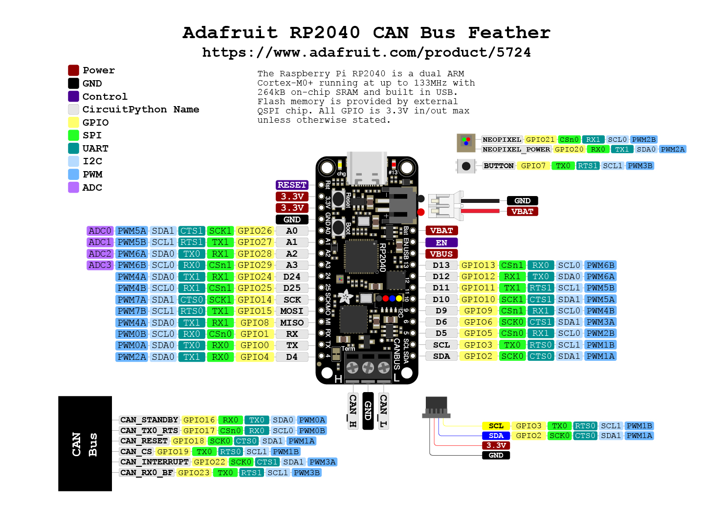
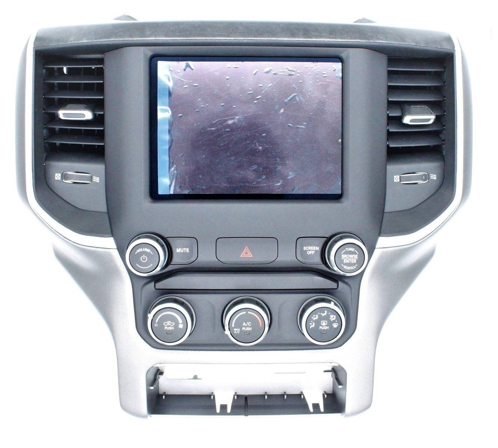

# uTurnOn - CAN sim

**Function**

Emulate CAN Bus Messages to force an FCA UConnect5 head unit to turn on outside of a car using a cheap Adafruit RP2040 Feather W/ CAN BUS dev board

**Why?**

In order to bench test, security test and upgrade a uConnect5 unit it is desirable to have it actually turn on outside of the car and in the comfort of an office. Existing bench testing cable solutions can be bought at a ridiculous price ($150+) and are missing functionality. It is much more fun to build your own test harness.

**Hardware**

**Required Hardware**

 - Adafruit_RP2040_CAN_Bus_Feather
 - An FCA UConnect5 unit like the r1low or r1high
 - 12vdc / 2a power source
 
Total: $12

**Compiling**

You will need to use these
 - VSCode
 - PlatformIO (in marketplace)

Once you install PlatformIO and restart VSCode, open the PlatformIO window and select "Pick a folder", to open the project. All the dependencies will be automatically downloaded.

